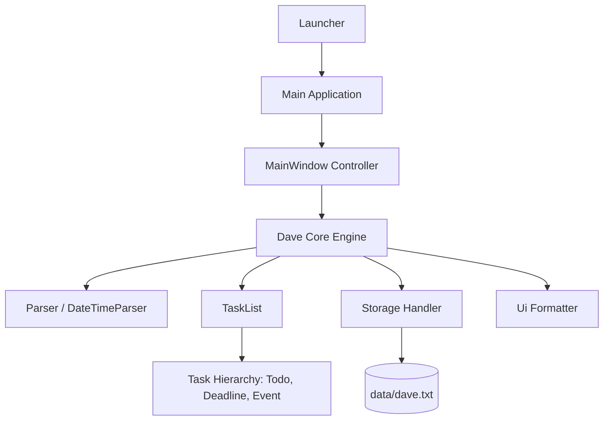

# Dave — Developer Guide

Welcome to the **Dave** developer documentation! Dave is an interactive desktop task management chatbot built with **Java 25**, **JavaFX 17**, and **Gradle**.

For end-user instructions and command syntax, please refer to the [User Guide](docs/README.md).

---

## Table of Contents

- [System Architecture](#system-architecture)
  - [Component Overview](#component-overview)
  - [Package Layout](#package-layout)
- [Development Setup](#development-setup)
  - [Prerequisites](#prerequisites)
  - [Setting up in IntelliJ IDEA](#setting-up-in-intellij-idea)
- [Build & Run Commands](#build--run-commands)
  - [Running the Application](#running-the-application)
  - [Running Tests](#running-tests)
  - [Checkstyle Verification](#checkstyle-verification)
  - [Packaging the JAR](#packaging-the-jar)
- [Design Details & Key Invariants](#design-details--key-invariants)
  - [Command Parsing & Delimiters](#command-parsing--delimiters)
  - [Strict Date & Calendar Parsing](#strict-date--calendar-parsing)
  - [Task Equivalence & Duplicate Detection](#task-equivalence--duplicate-detection)
  - [Persistent Storage & Resilience](#persistent-storage--resilience)
  - [GUI & Dynamic Viewport](#gui--dynamic-viewport)
- [Coding Standards & Conventions](#coding-standards--conventions)

---

## System Architecture

### Component Overview



- **`dave.Launcher` / `dave.Main`**: Initializes the JavaFX application runtime and loads FXML views.
- **`dave.gui`**: Contains GUI controllers (`MainWindow`, `DialogBox`) managing user interaction, custom avatars, scroll listeners, and dynamic message rendering.
- **`dave.Dave`**: The central orchestrator that processes user input, coordinates parsing, invokes task operations, persists updates, and returns response strings.
- **`dave.parser`**: Parses command tokens, extracts task attributes, resolves calendar date-times, and validates command grammar.
- **`dave.task`**: Domain model representing tasks (`Todo`, `Deadline`, `Event`, `IndexedTask`) and the collection container (`TaskList`).
- **`dave.storage`**: Handles reading from and writing to disk in pipe-separated format (`data/dave.txt`).
- **`dave.ui`**: Generates user-facing string representations, banners, lists, and status messages.

### Package Layout

```text
src/main/java/dave/
├── Dave.java                  # Central logic and command dispatcher
├── Launcher.java              # JavaFX entry point wrapper
├── Main.java                  # JavaFX Application launch controller
├── command/
│   └── Command.java           # Command keyword enum
├── exception/
│   └── DaveCommandException.java # Checked application exception
├── gui/
│   ├── DialogBox.java         # Chat bubble component with avatar
│   └── MainWindow.java        # Main window layout and scroll controller
├── parser/
│   ├── DateTimeParser.java    # Strict calendar date-time parsing
│   ├── Parser.java            # Command line syntax and delimiter validation
│   └── SnoozeRequest.java     # Polymorphic snooze operation request
├── storage/
│   └── Storage.java           # File persistence and corrupted-line tracking
├── task/
│   ├── Deadline.java          # Due-date task
│   ├── Event.java             # Timeframe event task (from < to)
│   ├── IndexedTask.java       # Pair of 1-based index and Task for search
│   ├── Task.java              # Abstract task base class
│   ├── TaskList.java          # In-memory collection of tasks
│   └── Todo.java              # Untimed todo task
└── ui/
    └── Ui.java                # Output text formatting
```

---

## Development Setup

### Prerequisites

- **JDK 25** (recommended: Eclipse Temurin, Oracle JDK, or OpenJDK 25).
- Verify your installation:
  ```sh
  java -version
  ```
- **Git** installed on your system.

### Setting up in IntelliJ IDEA

1. Clone or open the repository folder in IntelliJ IDEA:
   `File` > `Open...` > Select the `ip` project root.
2. Ensure IntelliJ imports the project as a **Gradle** project.
3. Configure the Project SDK:
   - Go to `File` > `Project Structure` > `Project`.
   - Set **SDK** to **JDK 25**.
   - Set **Language level** to **SDK default** (or `25`).
4. Configure Gradle JVM:
   - Go to `Settings` (or `Preferences` on macOS) > `Build, Execution, Deployment` > `Build Tools` > `Gradle`.
   - Set **Gradle JVM** to **JDK 25**.
5. Build and reload Gradle: click the **Reload All Gradle Projects** button in the Gradle tool window.

---

## Build & Run Commands

Use the bundled Gradle wrapper (`./gradlew` on Linux/macOS, `gradlew.bat` on Windows).

### Running the Application

- **Run GUI mode:**
```sh
./gradlew run
```

### Running Tests

Execute all JUnit 5 tests:
```sh
./gradlew test
```

Test reports are generated in `build/reports/tests/test/index.html`.

### Checkstyle Verification

Verify adherence to coding style standards:
```sh
./gradlew checkstyleMain checkstyleTest
```

Checkstyle reports are generated under `build/reports/checkstyle/`.

### Packaging the JAR

Package the standalone executable shadow JAR (includes JavaFX runtime dependencies):
```sh
./gradlew shadowJar
```

The resulting executable JAR will be located at:
```text
build/libs/dave.jar
```

You can run the packaged JAR directly:
```sh
java -jar build/libs/dave.jar
```

---

## Design Details & Key Invariants

### Command Parsing & Delimiters
- **Flag Patterns:** Delimiters (`/by`, `/from`, `/to`) use precompiled regular expressions matching word boundaries.
- **Occurrence Bounds:** Duplicate delimiters (e.g. repeated `/by` flags) are caught and rejected.
- **Delimiter Ordering:** For events, `/from` and `/to` can appear in any order.
- **Reserved Delimiter Guard:** The pipe character `|` is strictly forbidden in task descriptions and search queries to guarantee storage serialization integrity.

### Strict Date & Calendar Parsing
- `DateTimeParser` utilizes `ResolverStyle.STRICT` with proleptic year pattern `uuuu-MM-dd`.
- Automatically rejects invalid calendar dates (such as `2026-02-30`, `2026-04-31`, or `2025-02-29` outside leap years) with clear diagnostic errors.
- Default time is `00:00` (midnight); dates with midnight are formatted as date-only (`MMM dd yyyy`).

### Task Equivalence & Duplicate Detection
- Each task type implements `isSameTask(Task other)`:
  - `Todo`: matches case-insensitive description.
  - `Deadline`: matches case-insensitive description and exact `by` date-time.
  - `Event`: matches case-insensitive description and exact `from` and `to` date-times.
- Invariant: `Event` requires `from.isBefore(to)` upon creation and rescheduling.
- `TaskList.hasDuplicate(Task)` checks for duplicates prior to adding any new task.

### Persistent Storage & Resilience
- Data is stored in `data/dave.txt` using pipe separation:
  - `T | 0 | read book`
  - `D | 1 | submit essay | 2026-10-15T18:00`
  - `E | 0 | orientation | 2026-11-01T00:00 | 2026-11-03T00:00`
- `Storage` wraps disk operations in both `IOException` and `SecurityException` handlers.
- Unreadable or corrupted lines are counted without terminating the application, and reported via a startup banner to the user interface.

### GUI & Dynamic Viewport
- Built using JavaFX FXML (`MainWindow.fxml`, `DialogBox.fxml`) and styled with `MainWindow.css`.
- `MainWindow` attaches dynamic height listeners to `dialogContainer` to automatically scroll to the latest message.
- `userInput` forwards mouse scroll events to `scrollPane` so users can scroll through messages without needing to move their cursor off the text field.

---

## Coding Standards & Conventions

This project strictly adheres to:
- **SE-EDU Java Coding Standard**:
  - 4-space indentation; 12-space `case` indentation with 16-space case bodies.
  - No wildcard imports.
  - Full Javadoc on classes, public/protected methods, and fields.
  - Assertions used to enforce internal invariants and preconditions.
- **SE-EDU Git Standard**:
  - Imperative mood subject line $\le 50$ characters with no trailing period.
  - Blank line between subject and body.
  - Body wrapped at 72 characters explaining *what* and *why*.
