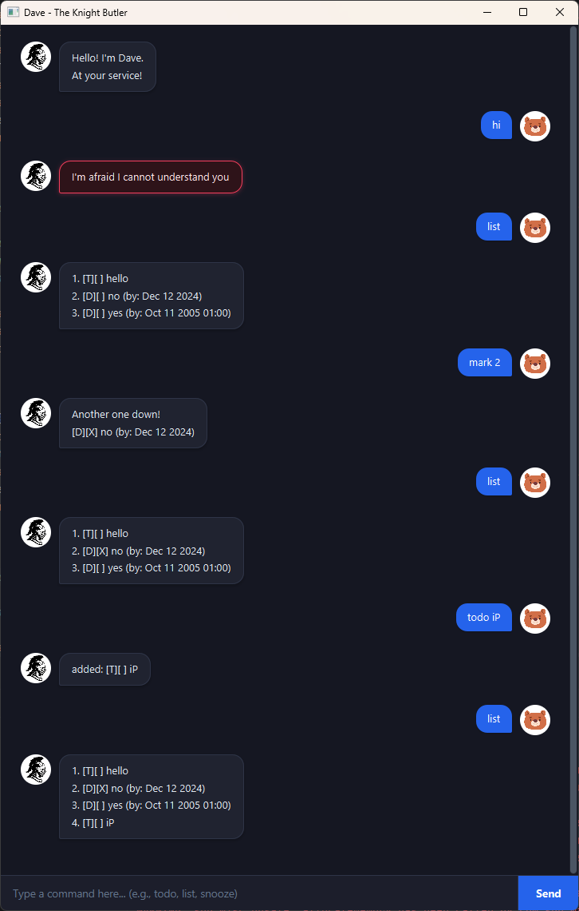

# Dave — User Guide

*Hello! I'm Dave. At your service!*

Dave is your focused desktop task companion. Add todos, deadlines, and events, track your
progress, and easily reschedule commitments through a clean, modern chat interface.



---

## Table of Contents

- [Quick Start](#quick-start)
- [Add Tasks](#add-tasks)
  - [Todo — Task without a date](#todo--task-without-a-date)
  - [Deadline — Task with a due date](#deadline--task-with-a-due-date)
  - [Event — Task with a start and end](#event--task-with-a-start-and-end)
- [View and Find Tasks](#view-and-find-tasks)
  - [List all tasks](#list-all-tasks)
  - [Find tasks by keyword](#find-tasks-by-keyword)
- [Update Tasks](#update-tasks)
  - [Mark, unmark, and delete](#mark-unmark-and-delete)
- [Snooze and Reschedule Tasks](#snooze-and-reschedule-tasks)
  - [Default snooze (postpone by 1 day)](#default-snooze-postpone-by-1-day)
  - [Relative snooze by duration](#relative-snooze-by-duration)
  - [Target deadline reschedule](#target-deadline-reschedule)
  - [Event boundary reschedule](#event-boundary-reschedule)
- [Dates and Times](#dates-and-times)
- [Exit Application](#exit-application)
- [Saving and Troubleshooting](#saving-and-troubleshooting)
- [Command Summary](#command-summary)

---

## Quick Start

1. Install **Java 25** (or compatible Java 17+). Open a terminal and run `java -version` to verify.
2. Download the latest `dave.jar` and place it in a dedicated working folder.
3. Open a terminal in that folder and launch Dave:

   ```sh
   java -jar dave.jar
   ```

4. In Dave, type `todo read chapter 4` and press **Enter** (or click **Send**).
5. Type `list` to inspect your task list, or try adding a deadline with `deadline submit proposal /by 2026-10-15 18:00`.

> [!TIP]
> - Enter one command at a time in the command input box.
> - The window is freely resizable.
> - You can scroll through the chat history at any time using your mouse scroll wheel (even when hovering over the input bar) or by dragging the vertical scrollbar.
> - Any invalid commands or errors are highlighted in red to grab your attention immediately.

---

## Add Tasks

Dave automatically detects and rejects duplicate tasks with identical descriptions and dates/times. Descriptions are compared case-insensitively for duplicates. Task descriptions must stay on one line, cannot be empty, and cannot contain the reserved `|` delimiter character.

### Todo — Task without a date
Adds an untimed task to your list.

- **Format:** `todo <description>`
- **Example:** `todo read textbook`
- **Response:**
  ```text
  added: [T][ ] read textbook
  ```

### Deadline — Task with a due date
Adds a task that must be completed by a specific date and optional time.

- **Format:** `deadline <description> /by <date> [time]`
- **Examples:**
  - `deadline submit assignment /by 2026-10-15 18:00`
  - `deadline pay bills /by 2026-11-01`
- **Response:**
  ```text
  added: [D][ ] submit assignment (by: Oct 15 2026 18:00)
  ```

> [!NOTE]
> The `/by` flag must appear exactly once. Irregular spaces around the delimiter are automatically handled.

### Event — Task with a start and end
Adds a scheduled event spanning a duration from a start date/time to an end date/time.

- **Format:** `event <description> /from <start date/time> /to <end date/time>`
- **Examples:**
  - `event project presentation /from 2026-10-20 14:00 /to 2026-10-20 16:00`
  - `event orientation camp /from 2026-11-01 /to 2026-11-03`
  - `event team lunch /to 2026-10-25 13:00 /from 2026-10-25 12:00` (delimiters can be in either order)
- **Response:**
  ```text
  added: [E][ ] project presentation (from: Oct 20 2026 14:00 to: Oct 20 2026 16:00)
  ```

> [!IMPORTANT]
> The start date/time must be strictly earlier than the end date/time. Both `/from` and `/to` must be specified exactly once.

---

## View and Find Tasks

### List all tasks
Displays all tasks currently tracked by Dave, along with their 1-based index numbers and status icons.

- **Format:** `list`
- **Response:**
  ```text
  1. [T][ ] read textbook
  2. [D][ ] submit assignment (by: Oct 15 2026 18:00)
  3. [E][ ] project presentation (from: Oct 20 2026 14:00 to: Oct 20 2026 16:00)
  ```
- **Task Markers:**
  - `[T]`: Todo
  - `[D]`: Deadline
  - `[E]`: Event
  - `[X]`: Completed task
  - `[ ]`: Uncompleted task

### Find tasks by keyword
Searches all task descriptions containing the specified search keyword or phrase.

- **Format:** `find <keyword>`
- **Example:** `find assignment`
- **Response:**
  ```text
  Here are the matching tasks in your list:
  2. [D][ ] submit assignment (by: Oct 15 2026 18:00)
  ```

> [!NOTE]
> Search results retain their original 1-based task numbers from the main list. For example, if `submit assignment` was item #2 in your list, it is displayed as `2. [D][ ] ...` so you can immediately follow up with commands like `mark 2`, `snooze 2`, or `delete 2`.

---

## Update Tasks

Use the 1-based task number shown in `list` or `find` to update or delete a task.

| Action | Format | Example | Description |
|---|---|---|---|
| **Mark as done** | `mark <task number>` | `mark 1` | Marks task 1 as completed (`[X]`). |
| **Unmark task** | `unmark <task number>` | `unmark 1` | Reverts task 1 to uncompleted (`[ ]`). |
| **Delete task** | `delete <task number>` | `delete 2` | Permanently removes task 2 from the list. |

> [!WARNING]
> Deletion is permanent and has no undo. After deleting a task, subsequent task numbers shift up by 1. Run `list` before choosing another task number.

---

## Snooze and Reschedule Tasks

Postpone or reschedule tasks with deadlines or event timeframes.

> [!NOTE]
> Todo tasks cannot be snoozed because they have no attached date or time.

### Default snooze (postpone by 1 day)
Shifts a deadline or both event boundaries forward by 1 day.

- **Format:** `snooze <task number>`
- **Example:** `snooze 2`
- **Response:**
  ```text
  Affirmative! I've snoozed this task:
      [D][ ] submit assignment (by: Oct 16 2026 18:00)
  ```

### Relative snooze by duration
Postpones a task forward by a specified amount and unit. Supported units: `days` (or `d`), `hours` (or `h`, `hrs`), `weeks` (or `w`), `minutes` (or `mins`, `m`). For events, both start and end times shift forward together, preserving the event's duration.

- **Format:** `snooze <task number> <amount> <unit>`
- **Examples:**
  - `snooze 2 3 days` (shifts forward by 3 days)
  - `snooze 2 2 hours` (shifts forward by 2 hours)
  - `snooze 3 1 week` (shifts event forward by 1 week)
- **Response:**
  ```text
  Affirmative! I've snoozed this task:
      [D][ ] submit assignment (by: Oct 19 2026 18:00)
  ```

### Target deadline reschedule
Reschedules a deadline to a specific new target date and optional time.

- **Format:** `snooze <task number> /to <date> [time]`
- **Example:** `snooze 2 /to 2026-10-25 20:00`
- **Response:**
  ```text
  Affirmative! I've snoozed this task:
      [D][ ] submit assignment (by: Oct 25 2026 20:00)
  ```

### Event boundary reschedule
Reschedules both boundaries of an event to new start and end dates/times.

- **Format:** `snooze <task number> /from <start date/time> /to <end date/time>`
- **Example:** `snooze 3 /from 2026-10-28 10:00 /to 2026-10-28 12:00`
- **Response:**
  ```text
  Affirmative! I've snoozed this task:
      [E][ ] project presentation (from: Oct 28 2026 10:00 to: Oct 28 2026 12:00)
  ```

---

## Dates and Times

Dave enforces strict calendar validation to keep your schedule accurate.

- **Supported Formats:**
  - `yyyy-MM-dd HH:mm` (e.g., `2026-10-15 18:00`)
  - `yyyy-MM-dd HHmm` (e.g., `2026-10-15 1800`)
  - `yyyy-MM-dd` (e.g., `2026-10-15`)
- **Strict Validation:**
  - Non-existent dates (such as `2026-02-30`, `2026-04-31`, or `2025-02-29` on non-leap years) are strictly rejected with an informative error message.
- **Midnight Default:**
  - Omitting the time portion defaults to `00:00` (midnight at the beginning of the date) and is displayed cleanly as date-only (e.g., `Oct 15 2026`).
- **Chronology:**
  - An event's start date/time must always be strictly before its end date/time.

---

## Exit Application

Exits Dave and automatically saves your state.

- **Format:** `bye`
- **Response:**
  ```text
  The wind calls. Farewell!
  ```
  *(Dave displays the farewell and automatically closes after 1 second)*

---

## Saving and Troubleshooting

### Persistent Storage
Dave automatically saves your task list to `data/dave.txt` in the folder from which the application is launched.
- The directory and file are created automatically when you first add a task.
- Changes are written to disk immediately after every successful command.
- Launch Dave from the same working directory to continue using your saved tasks.

### Troubleshooting Common Problems

| Problem | Cause | Solution |
|---|---|---|
| `I'm afraid I cannot understand you` | Unrecognized command word or typo | Check the [Command Summary](#command-summary) for supported commands. |
| `NEGATIVE! Invalid date: date does not exist on the calendar...` | Non-existent calendar date (e.g. Feb 30, Apr 31) | Ensure the date is a valid day on the calendar in `yyyy-MM-dd` format. |
| `NEGATIVE! Event start date/time must be strictly earlier than end date/time.` | Event `/from` time is later than or equal to `/to` time | Ensure the event start comes before the event end. |
| `NEGATIVE! This task already exists in your list...` | Adding an identical task | You already have this task. Delete or update the existing task first. |
| `NEGATIVE! ... cannot contain the '\|' character` | Reserved storage separator used | Do not use the `\|` character in task descriptions or search queries. |
| `NEGATIVE! The /by delimiter cannot be specified multiple times.` | Repeated delimiter flags | Specify `/by`, `/from`, and `/to` only once per command. |
| `Wrong number!` | Task number is non-positive, not a number, or out of range | Use `list` to inspect valid positive task numbers (e.g., `mark 1`). |
| `Warning: N corrupted task entry(ies) in data file could not be read...` | Data file contains corrupted or manually edited invalid lines | Dave safely skips corrupted lines and loads valid tasks. Check `data/dave.txt` to fix any manual formatting errors. |
| `Unable to access storage file (permission denied)` | File access permissions restricted | Ensure your operating system user account has read/write access to the folder. |

---

## Command Summary

| Command | Syntax | Example |
|---|---|---|
| **Add Todo** | `todo <description>` | `todo buy milk` |
| **Add Deadline** | `deadline <description> /by <date> [time]` | `deadline return book /by 2026-10-15 18:00` |
| **Add Event** | `event <description> /from <start> /to <end>` | `event party /from 2026-10-20 18:00 /to 2026-10-20 22:00` |
| **List Tasks** | `list` | `list` |
| **Find Tasks** | `find <keyword>` | `find book` |
| **Mark Task** | `mark <task number>` | `mark 1` |
| **Unmark Task** | `unmark <task number>` | `unmark 1` |
| **Delete Task** | `delete <task number>` | `delete 1` |
| **Snooze (1 Day)** | `snooze <task number>` | `snooze 1` |
| **Snooze (Duration)** | `snooze <task number> <amount> <unit>` | `snooze 1 3 days` |
| **Snooze (Target Date)** | `snooze <task number> /to <date> [time]` | `snooze 1 /to 2026-10-25 18:00` |
| **Snooze (Reschedule Event)** | `snooze <task number> /from <start> /to <end>` | `snooze 2 /from 2026-10-25 10:00 /to 2026-10-25 12:00` |
| **Exit** | `bye` | `bye` |
